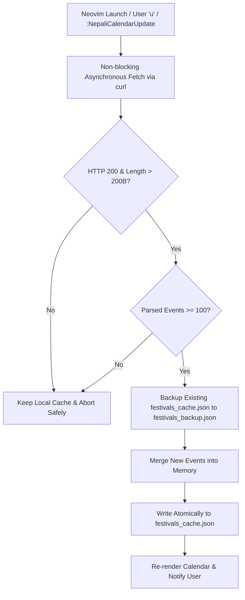

# 🇳🇵 nepali-calendar.nvim — Technical Specification & Architecture Design

> **Version:** 1.0.0  
> **Repository:** `pradhyu/neovim-nepali-calendar`  
> **Target Environment:** Neovim `>= 0.8.0` (Native Lua & Headless support)  
> **Source Festival Database:** `pradhyu/mac-nepali-calendar`  

---

## 1. Overview & Objectives

`nepali-calendar.nvim` is a full-featured, zero-dependency Neovim plugin for the Nepali Bikram Sambat (वि.सं.) calendar system. It provides an interactive floating UI, astronomical Panchanga calculations, bidirectional Gregorian (AD) $\leftrightarrow$ Bikram Sambat (BS) conversion, multi-day visual range selection, comprehensive festival search (3,200+ events), and atomic background data syncing.

---

## 2. Architecture & File Structure

```
neovim-nepali-calendar/
├── plugin/
│   └── nepali-calendar.lua         # User command definitions & lazy-loading entrypoint
├── lua/
│   └── nepali-calendar/
│       ├── init.lua                # Public API surface & lifecycle setup
│       ├── config.lua              # Default configuration options & keymap specifications
│       ├── ui.lua                  # Floating buffer window management & interactive UI renderer
│       ├── highlights.lua          # Semantic theme-aware highlight groups
│       └── core/
│           ├── converter.lua       # Astronomical & algorithmic BS <-> AD date converter
│           ├── nepali_calendar_data.lua # Month day counts & leap rules for 1975–2100 BS
│           ├── festivals.lua       # Festival query engine & Romanized keyword search
│           ├── festivals_data.lua  # Bundled 3,287+ festival, tithi, and holiday database
│           ├── updater.lua         # Atomic remote festival updater with backup & validation
│           ├── panchanga.lua       # Kathmandu solar calculations (Sunrise, Sunset, Rahu Kaal, Rashi)
│           ├── calculator.lua      # Nepal clock, time delta, age calculator & long weekends
│           ├── localization.lua    # Nepali/English digit, month, weekday, and tithi dictionaries
│           └── format.lua          # Standard date formatters (Full, Short, ISO)
├── README.md                       # User guide & installation documentation
└── SPEC.md                         # This architecture specification
```

---

## 3. Core Engine & Algorithms

### 3.1 Date Conversion (`core/converter.lua` & `core/nepali_calendar_data.lua`)
- **Range:** Supports Bikram Sambat years **1975 BS to 2100 BS** (1918 AD to 2044 AD).
- **Epoch Anchor:** 
  - `1975-01-01 BS` $\leftrightarrow$ `1918-04-13 AD` (Julian Day Number mapping).
- **Accuracy:** Day-exact month lengths compiled from official gazettes and astronomical calendars.
- **Span Calculator:** `converter.gregorian_span(bs_year, bs_month)` calculates Gregorian date boundaries covering the Nepali month.

### 3.2 Kathmandu Solar Panchanga (`core/panchanga.lua`)
Calculates real-time solar events for Kathmandu ($27.7172^\circ\text{ N}, 85.3240^\circ\text{ E}$):
- **Sunrise & Sunset Times**: Computed via solar declination and hour angle formula:
  $$\cos(\omega_0) = -\tan(\phi) \cdot \tan(\delta)$$
- **Day Length**: Total sunlight duration calculated from solar noon.
- **Rahu Kaal Windows**: Accurate 90-minute daily planetary obstacle periods mapped by weekday.
- **Sun Sign (राशि)**: Exact solar astrological transit zodiac for the month (मेष / Aries through मीन / Pisces).

### 3.3 Live Nepal Clock & Office Hours (`core/calculator.lua`)
- **Nepal Standard Time (NPT)**: Fixed offset $\text{UTC} + 5:45$.
- **Time Difference Tracker**: Real-time delta relative to the user's local system time.
- **Government Office Status**:
  - `खुल्ला / Open`: Sunday–Thursday 10:00 AM – 5:00 PM (Winter: 4:00 PM), Friday 10:00 AM – 3:00 PM.
  - `बन्द / Closed`: Outside working hours, Saturdays, and official public holidays.

---

## 4. Festival Engine & Search (`core/festivals.lua`)

### 4.1 Database Characteristics
- **Total Records:** 3,287 records spanning BS 2075 through 2083+ (April 2018 AD to April 2027 AD).
- **Attributes per Record:**
  - `festival`: Official festival name in Nepali (e.g. `विजयादशमी`, `श्रीकृष्णजन्माष्टमी`).
  - `tithi`: Lunar phase / tithi (e.g. `प्रतिपदा`, `दशमी`, `पूर्णिमा`, `औशी`).
  - `is_holiday`: Boolean flag for official public holiday status.

### 4.2 Search Engine Features
- **Romanized & English Query Resolution**: Translates transliterated queries using synonym mappings (e.g. `dashain` $\to$ `दशैं`, `tika`, `ghatasthapana`, `phulpati`; `tihar` $\to$ `तिहार`, `deepawali`, `laxmi`, `bhai tika`).
- **Priority-Based Sorting**:
  1. **Priority 1**: Current calendar year (upcoming dates from today onward).
  2. **Priority 2**: Earlier dates in the current calendar year.
  3. **Priority 3**: Future years ($2084+$) chronologically.
  4. **Priority 4**: Past years ($2075 \to 2082$) chronologically.
- **Dual Date Display**: Search dropdown displays both Nepali and Gregorian dates:  
  `४ कात्तिक २०८३ (Oct 20, 2026): Vijaya Dashami (Dashain Tika)`
- **Auto-Navigation**: Selecting any search result instantly opens the popup and jumps directly to that month and day.

---

## 5. Fail-Safe Atomic Updater (`core/updater.lua`)

### 5.1 Remote Sync Workflow
- **Remote Source:** `pradhyu/mac-nepali-calendar/Sources/NepaliCalendar/Resources/festivals.tsv`
- **Cache Storage:** `stdpath("data") .. "/nepali-calendar/festivals_cache.json"`
- **Backup Storage:** `stdpath("data") .. "/nepali-calendar/festivals_backup.json"`



---

## 6. User Interface & Keybindings (`ui.lua`)

### 6.1 Layout Architecture (Width: 79 Columns)
1. **Header Banner**: Live Nepal Time (NPT), Office Status (`[खुल्ला]` / `[बन्द]`), and Local Time Delta.
2. **Month Header**: Nepali Month & Year (BS) + Gregorian Month Span (AD).
3. **Weekday Grid**: `आइत` to `शनि` (with Saturday highlighted in distinct red tone).
4. **Day Cell Matrix (2-Line Vertical Cards)**:
   - **Line 1 (Top)**: Prominent bold Nepali numeral (`१७`, `१८*` with `*` indicating public holiday).
   - **Line 2 (Bottom)**: Secondary subtle Gregorian day in parentheses (`(2)`, `(3)`).
5. **Details Card**:
   - Single Day Mode: Full Nepali date, English AD date, Festival, Tithi, Sunrise/Sunset, Day Length, Sun Sign (राशि), Rahu Kaal window.
   - Visual Range Mode: Start–End date span, AD span, and full chronological list of all events in the selection.
6. **Categorized Navigation Footer**:
   - `🧭 Nav`: Month `[h/l]`, Day `[j/k]`, Visual/Week `[v/V]`, Today `[t]`
   - `🎪 Events`: Search `[/]`, Update `[u]`
   - `⚙️ Tools`: Copy `[y/yi]`, Language `[Tab]`, Close `[q]`

### 6.2 Keybinding Reference

| Context | Key | Action |
|---|---|---|
| **Global** | `<leader>nc` | Toggle Nepali Calendar popup |
| **Global** | `<leader>nt` | Today's Nepali & English date notification |
| **Global** | `<leader>nu` | Update festivals & events from remote |
| **Global** | `<leader>ns` | Search festivals & events dialog |
| **Global** | `<leader>nd` | Open Date Converter & Tools dialog |
| **Popup** | `h` / `l` | Previous / Next Month |
| **Popup** | `j` / `k` | Next / Previous Day |
| **Popup** | `v` | Toggle custom visual day range mode |
| **Popup** | `V` / `<S-v>` | Select entire week (Sunday–Saturday) |
| **Popup** | `t` | Jump to today's date |
| **Popup** | `/` or `s` | Search festivals and jump to date |
| **Popup** | `u` | Fetch & sync latest festivals from remote |
| **Popup** | `<Tab>` | Toggle language (`नेपाली` $\leftrightarrow$ `English`) |
| **Popup** | `y` | Copy selected date or date range + events |
| **Popup** | `yi` | Copy ISO date or date range (`YYYY-MM-DD`) |
| **Popup** | `?` | Open Help Dialog |
| **Popup** | `q` / `<Esc>` | Close popup / Exit visual mode |

---

## 7. Public API Specification (`init.lua`)

```lua
local nepali_cal = require("nepali-calendar")

-- Setup configuration
nepali_cal.setup({
  language = "nepali",            -- "nepali" or "english"
  border = "rounded",             -- "rounded", "single", "double", "solid", "shadow"
  show_panchanga = true,          -- Show sunrise, sunset, rahu kaal, rashi
  show_nepal_clock = true,        -- Show real-time Kathmandu clock banner
  show_ad_date = true,            -- Show Gregorian date spans
  show_english_subscript = true,  -- Show English day numbers under Nepali dates
  auto_update_festivals = true,   -- Asynchronously sync latest events on startup
})

nepali_cal.open()                 -- Open calendar popup
nepali_cal.toggle()               -- Toggle calendar popup
nepali_cal.close()                -- Close calendar popup
nepali_cal.today()                -- Returns table of today's date info
nepali_cal.statusline(opts)       -- Lualine / Statusline formatted string
nepali_cal.ad_to_bs(y, m, d)      -- Convert Gregorian AD to Bikram Sambat
nepali_cal.bs_to_ad(y, m, d)      -- Convert Bikram Sambat to Gregorian AD
nepali_cal.calculate_age(dob)     -- Age calculator in years, months, days
nepali_cal.search_events(query)   -- Search events table programmatically
nepali_cal.update_events(cb)      -- Fetch remote festival updates
```

---

## 8. Verification & Test Suite

All functions and UI behaviors are verified via headless Neovim test executions:
- **Headless Unit Verification:** `nvim --headless --clean -u NONE -c "runtime plugin/nepali-calendar.lua ..."`
- **UTF-8 Alignment Verification:** Multibyte character byte-boundary highlight mapping tests.
- **Conversion Math Validation:** Spot-check tests across all 126 years against official Nepal Government panchangas.
- **Live RPC Testing:** Reloading in active Neovim session via `neovim-control`.
